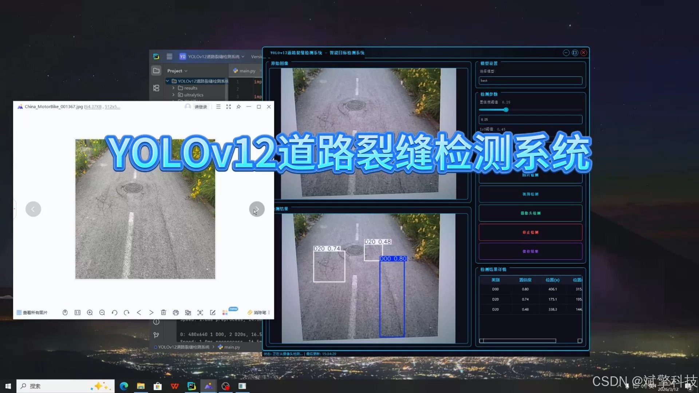
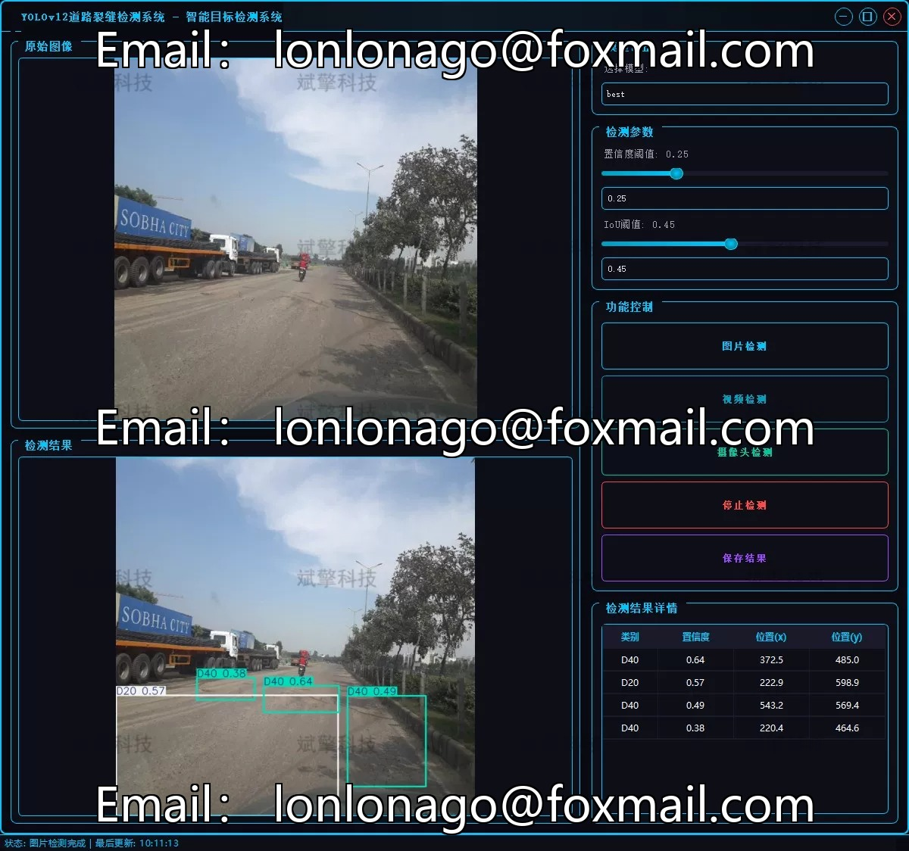
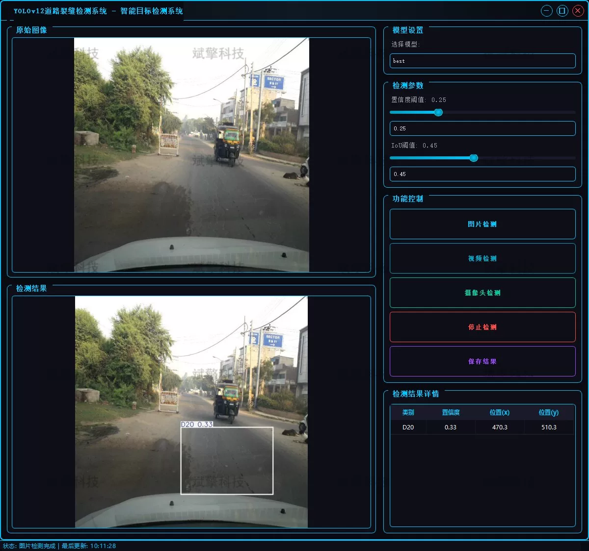
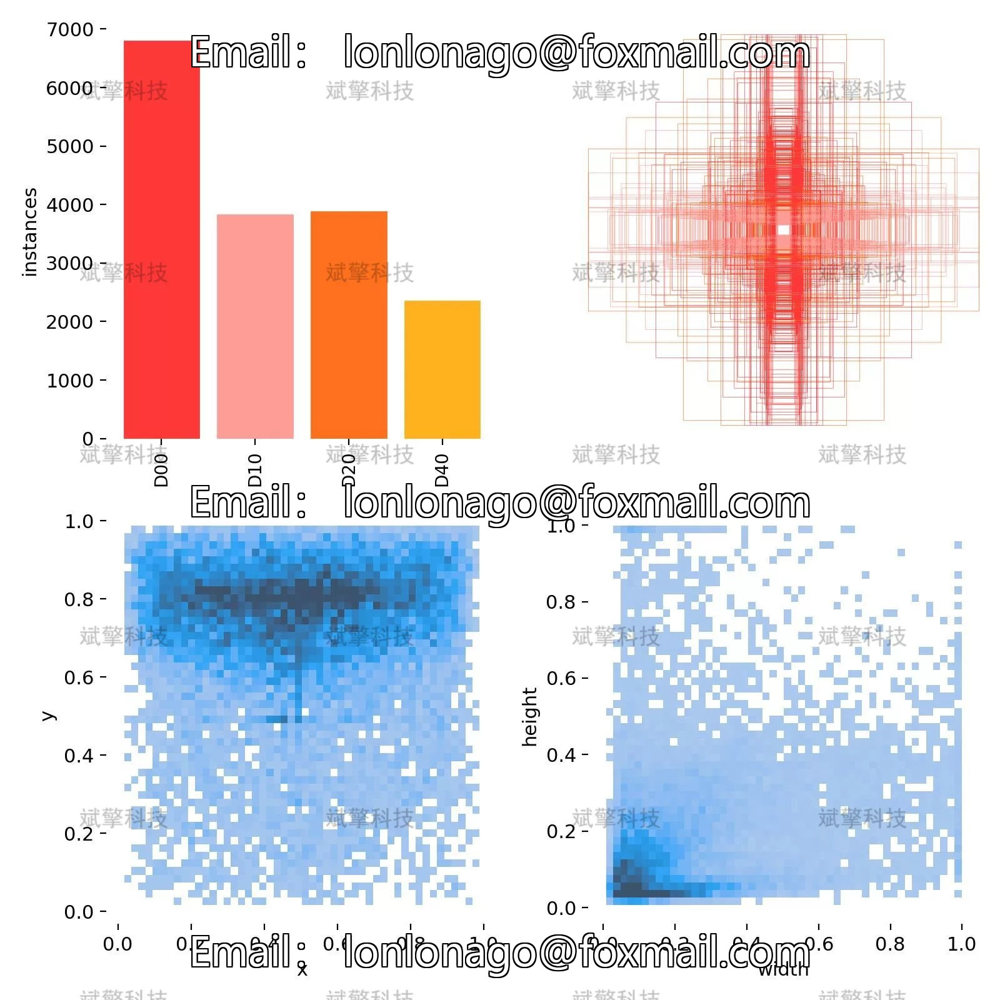
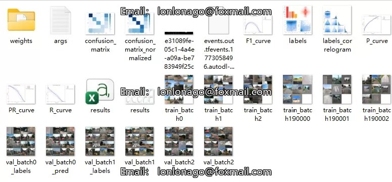
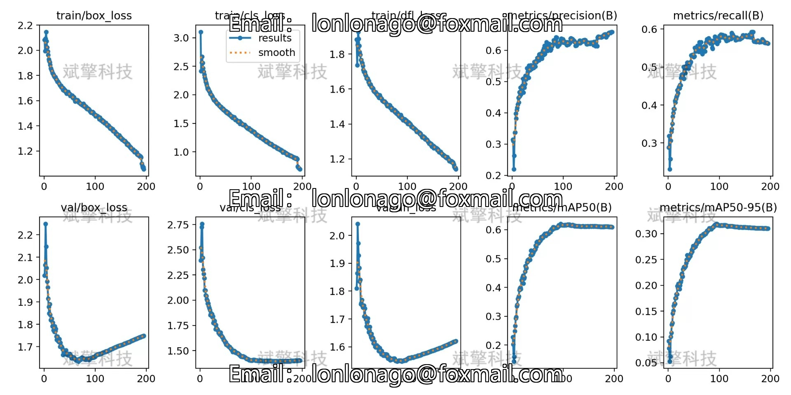
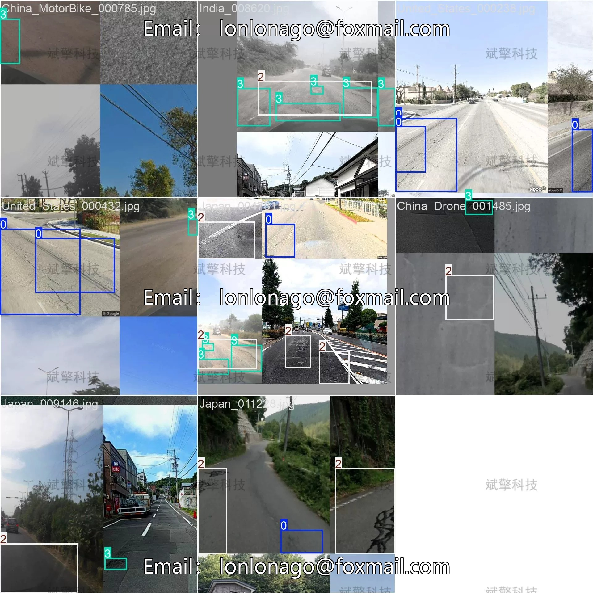
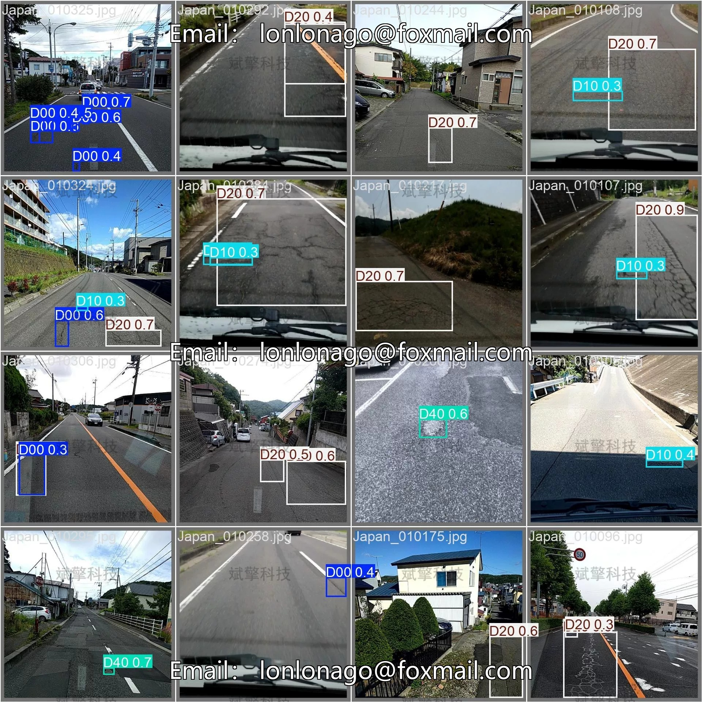

# YOLOv12 Road Crack Detection System

## Body

YOLOv12 Road Crack Detection System Based on Deep Learning YOLOv12, Road Crack Detection System (YOLOv12+YOLO dataset + UI interface + login registration interface + Python project source code + model)

This project is based on the latest released YOLOv12 object detection algorithm and has developed a complete road crack detection system. As the latest member of the YOLO series, YOLOv12 not only maintains high detection speed but also further improves detection accuracy, especially suitable for recognizing small crack targets. The system provides three detection modes: image detection, video detection, and real-time camera detection, which can be flexibly applied to different scenarios. Image detection supports batch processing of single or multiple images; video detection can analyze recorded road videos; real-time camera detection can connect with surveillance cameras or vehicle recorders to achieve real-time road crack early warning.

System Function Overview

✅ User Login and Registration: Supports password verification and security validation.

✅ Three Detection Modes: Based on the YOLOv12 model, supports image, video, and real-time camera detection, accurately recognizes targets.

✅ Dual Screen Comparison: Displays the original screen and detection results in the same screen.

✅ Data Visualization: Real-time table displaying the category, confidence, and coordinates of detected targets.

✅ Intelligent Parameter Adjustment: Offers a confidence slide bar, dynamically optimizes detection accuracy to meet different scene needs.

✅ Sci-Fi Style Interactive Interface: Dark theme combined with dynamic light effects, reduces visual fatigue and enhances operational experience.

✅ Multi-thread High-Performance Architecture: Independent detection threads ensure smooth operation, real-time status prompts, and rapid response without lag.

Dataset Introduction

Training set: 8000 images, used for model training and learning
Validation set: 2000 images, used for model performance evaluation and parameter tuning

## Images

## Payment

Here is a pay link on Stripe ( https://buy.stripe.com/3cs8yP7sY87d0vu9AB ). Please contact me lonlonago@foxmail.com after funding $89, and I will send you a complete data files , thank you!

